# Jarkom-Modul-2-IT09-2024

| Nama | NRP |
|---------|---------|
| Gavriel Pramuda Kurniaadi | 5027221031  |
| Stephanie Hebrina Mabunbun Simatupang | 5027221069  | 


# no 12
> Karena pusat ingin sebuah website yang ingin digunakan untuk memantau kondisi markas lainnya maka deploy lah webiste ini (cek resource yg lb) pada severny menggunakan apache

Install :
```
apt-get update
apt-get install lynx
apt-get install apache2
apt-get install php
apt-get install libapache2-mod-php7.0`

wget --no-check-certificate 'https://drive.google.com/uc?export=download&id=1xn03kTB27K872cokqwEIlk8Zb121HnfB' -O /var/www/jarkom-it09/lb.zip

unzip /var/www/jarkom-it09/lb.zip -d /var/www/jarkom-it09/

mv /var/www/jarkom-it09/worker/index.php /var/www/html/
```

ke dir apache2/sites-available kemudian edit file .conf nya :

```
cd /etc/apache2/sites-available
cp 000-default.conf jarkom-it09.conf
nano jarkom-it09.conf
```

di file jarkom-it09.conf edit bagian :
``` 
<VirtualHost *:8080> 
#ubah portnya menjadi 8080
ServerAdmin webmaster@localhost
DocumentRoot /var/www/jarkom-it09
```

Tambahkan port 8080 juga di file ports.conf :
```
cd /etc/apache2
nano ports.conf
```

Tambahan di File ports :
```
Listen 80
Listen 8080 #tambah ini
```

Jalanin command :
```
a2ensite jarkom-it09.conf
service apache2 restart
```

run di :
```
lynx http://10.68.3.2:8080
```

Outputnya :
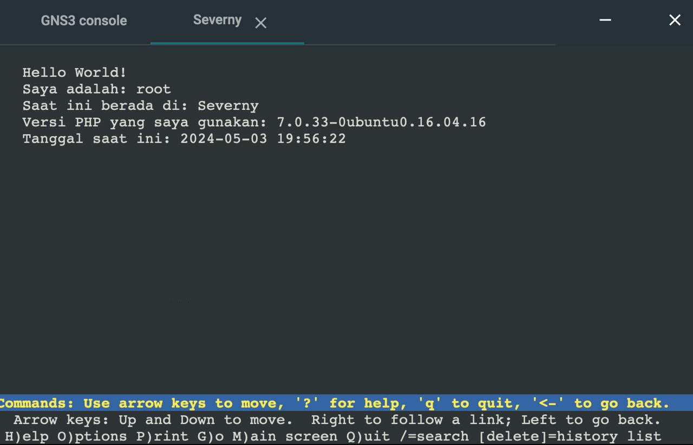

# no 13 
> Tapi pusat merasa tidak puas dengan performanya karena traffic yag tinggi maka pusat meminta kita memasang load balancer pada web nya, dengan Severny, Stalber, Lipovka sebagai worker dan Mylta sebagai Load Balancer menggunakan apache sebagai web server nya dan load balancernya

Instal :
```
apt-get update
apt-get install apache2
a2enmod proxy
a2enmod proxy_http
a2enmod proxy_balancer
a2enmod lbmethod_byrequests
service apache2 restart
```

```
cd /etc/apache2/sites-available/
```

define addres ketiga workersnya :
```
#address
serverny="10.68.3.2"
stalber="10.68.3.3"
lipovka="10.68.3.4"
```

Isi config file :
```
echo "<VirtualHost *:8080>
    ServerAdmin webmaster@localhost
    DocumentRoot /var/www/web-8080
    ServerName 10.68.2.5

    ProxyRequests Off
    <Proxy balancer://mycluster>
        BalancerMember http://${serverny}:8080
        BalancerMember http://${stalber}:8080
        BalancerMember http://${lipovka}:8080
        ProxySet lbmethod=byrequests
    </Proxy>

    ProxyPass / balancer://mycluster/
    ProxyPassReverse / balancer://mycluster/
</VirtualHost>" > default-8080.conf
```

```
cd ..
echo 'Listen 8080' >> ports.conf
```

Run apache2 nya :
```
a2ensite default-8080.conf
service apache2 restart
```

Output : 
> worker
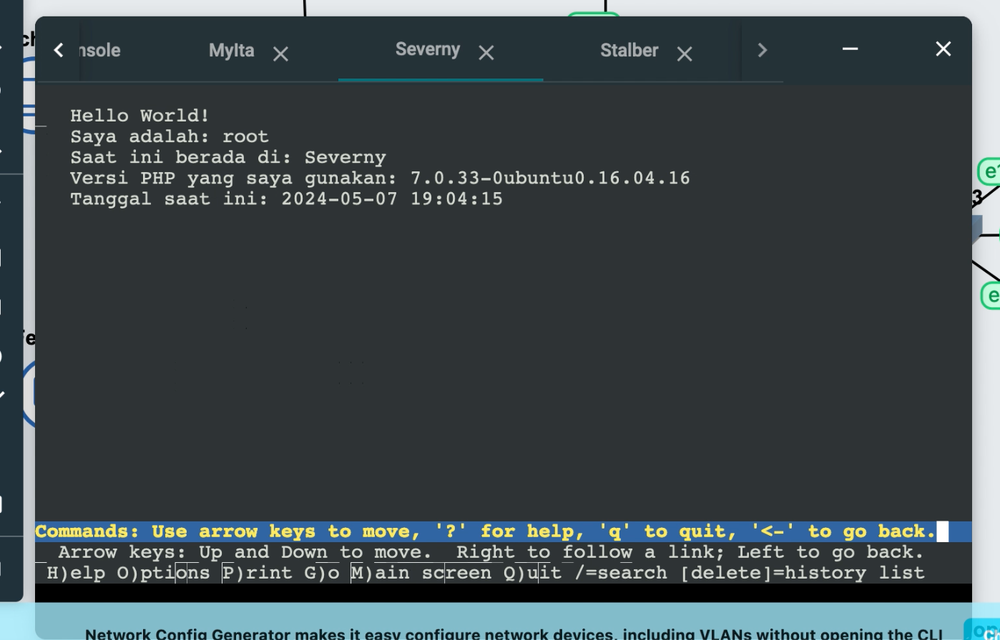

> load balancer
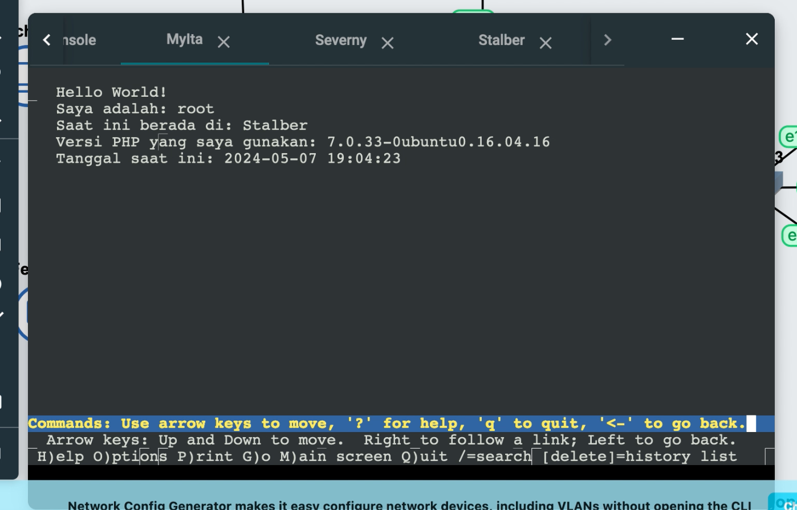

# no 14
> Mereka juga belum merasa puas jadi pusat meminta agar web servernya dan load balancer nya diubah menjadi nginx

Install :
```
apt-get update
apt-get install dnsutils -y
apt-get install lynx -y
apt-get install nginx -y
apt-get install apache2 -y
apt-get install libapache2-mod-php7.0
apt-get install wget -y
apt-get install unzip -y
apt-get install php -y
apt-get install php-fpm -y
```

> Load balancer (mylta)
Atur port di :
```
cd /etc/apache2
nano ports.conf
```

Buat menjadi :
```
Listen 8080
```

Nginxnya distart :
```
service nginx start
```

Pindah direktori dan tambahkan file :
```
cd /etc/nginx/sites-available/
nano jarkom-it09
```

Isi nano jarkom-it09 :
```
upstream myita {
    server 10.68.3.2:8080; #stabler
    server 10.68.3.2:8080; #serverny
    server 10.68.3.2:8080; #lipvoka
}

server {
  listen 8080;
  server_name 10.68.2.5;

  location / {
    proxy_pass http://myita;
  }
}
```

Run jarkom-it09 :
```
ln -s /etc/nginx/sites-available/jarkom-it09 /etc/nginx/sites-enabled
rm /etc/nginx/sites-enabled/default
service nginx restart
```

> Worker (severny, stalber, libovka) :

Pindah direktori dan edit port:
```
cd /etc/apache2
nano ports.conf
```

Tambah :
```
Listen 8080
```

Run :
```
service nginx start
```

Check isi file /var/www/jarkom-it09 :
```
cd /var/www/jarkom-it09
```

Disini isi file nano index.php harusnya sama dengan nomor 12 karena sudah didownload tadi dari wget.

>Isi index.php :
```
<?php
$hostname = gethostname();
$date = date('Y-m-d H:i:s');
$php_version = phpversion();
$username = get_current_user();


echo "Hello World!<br>";
echo "Saya adalah: $username<br>";
echo "Saat ini berada di: $hostname<br>";
echo "Versi PHP yang saya gunakan: $php_version<br>";
echo "Tanggal saat ini: $date<br>";
?>
```

Pindah direkotri : 
```
cd /etc/nginx/sites-available/
nano jarkom-it09
```

Jarkom-it09 : 
```
server {

    listen 8080;

    root /var/www/jarkom-it09;

    index index.php index.html index.htm;
    server_name _;

    location / {
        try_files \$uri \$uri/ /index.php?\$query_string;
    }

    # pass PHP scripts to FastCGI server
    location ~ \.php$ {
        include snippets/fastcgi-php.conf;
        fastcgi_pass unix:/var/run/php/php7.0-fpm.sock;
    }

    location ~ /\.ht {
     deny all;
    }

    error_log /var/log/nginx/jarkom-it09_error.log;
    access_log /var/log/nginx/jarkom-it09_access.log;
}
```

```
ln -s /etc/nginx/sites-available/jarkom-it09 /etc/nginx/sites-enabled
rm /etc/nginx/sites-enabled/default
```

Run nginx dengan restart :

```
service nginx restart
```

Also run phpnya juga : 
```
service php7.0-fpm start
```

Ini untuk check apakah sudah berhasil dirun atau tidak phpnyaaa :
```
service php7.0-fpm status
```

Ouptut : 
> lnyx 10.68.3.2:8080 : stabler

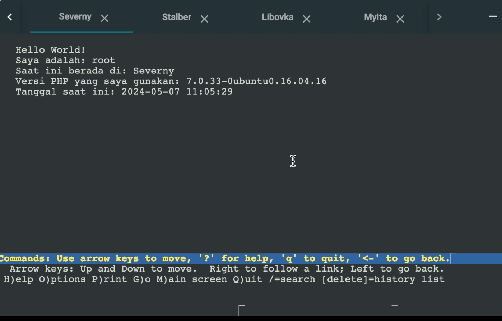
> lynx 10.68.3.2:8080 : serverny

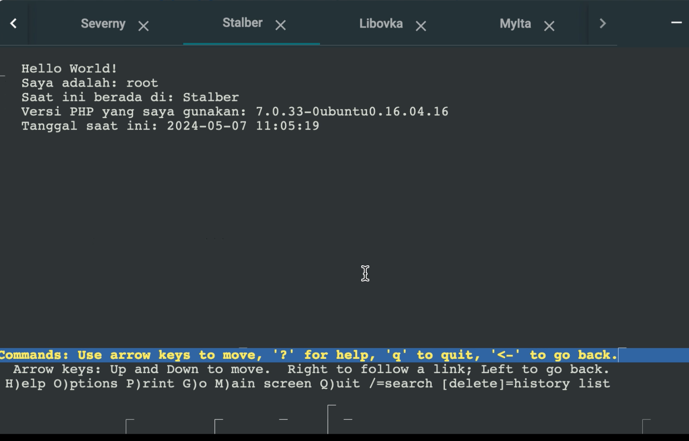

> lynx 10.68.3.2:8080 : lipvoka

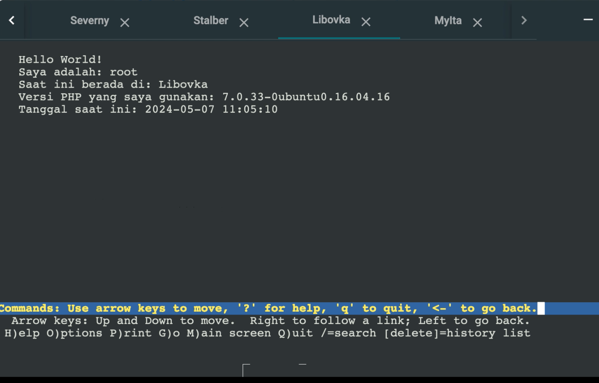

> lynx 10.68.25:8080 : mylta

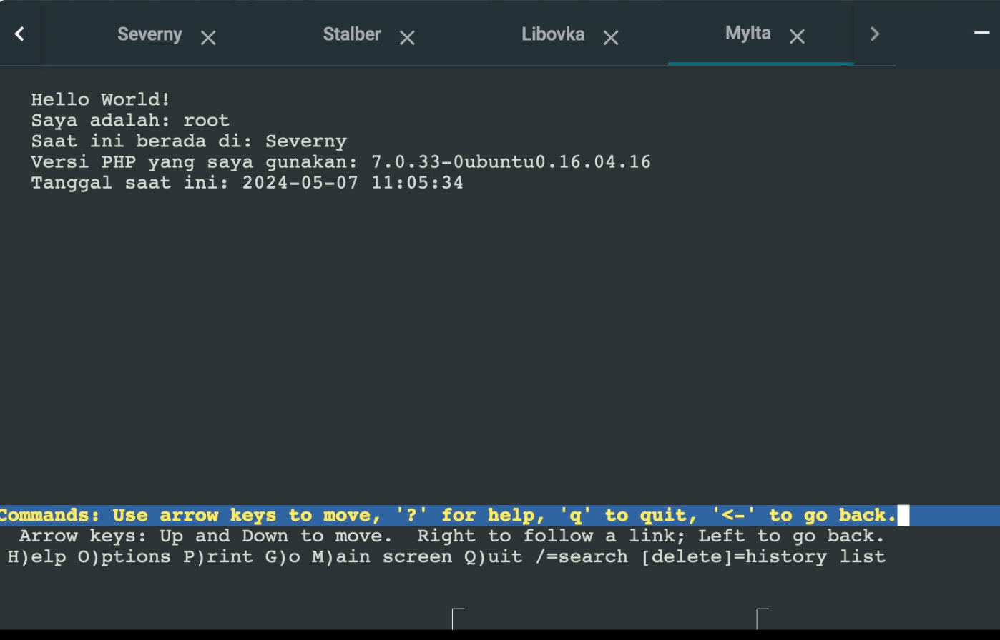

# no 15
Markas pusat meminta laporan hasil benchmark dengan menggunakan apache benchmark dari load balancer dengan 2 web server yang berbeda tersebut dan meminta secara detail dengan ketentuan:
Nama Algoritma Load Balancer
Report hasil testing apache benchmark 
Grafik request per second untuk masing masing algoritma. 
Analisis

Berdasarkan soal diatas kita harus intall :
``` 
apt-get install apache2-utils
```
Command tersebut digunakan untuk menguji kinerja server web Apache atau server web lainnya

Melakukan pengujian (benchmarking) untuk menguji algoritma load balancing :

```
ab -n 10 -c 2 http://10.68.2.5:8080/ 

```

Command diatas untuk mengirim 10 request, 1 waktunya 2 request

> Round-robin :

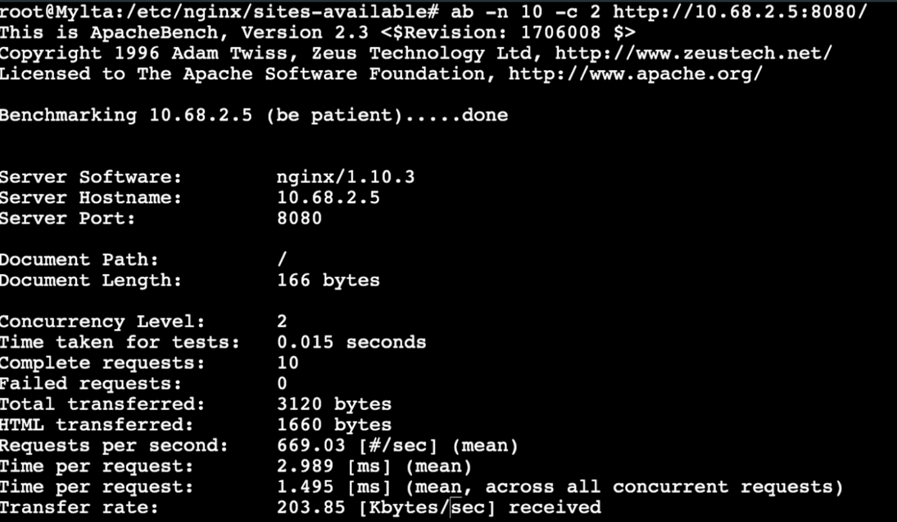

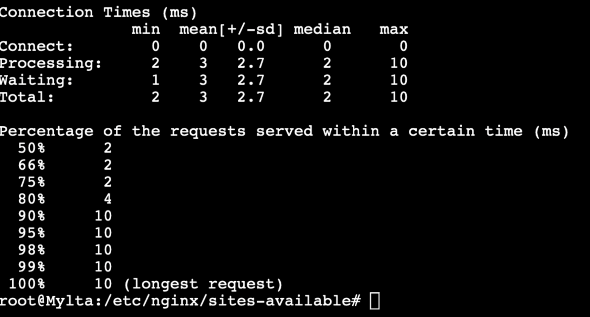
Kesimpulannya adalah bahwa server mampu menangani beban dengan baik. Tidak ada permintaan yang gagal, tingkat throughput tinggi, waktu respons yang cepat, dan kecepatan transfer yang tinggi semuanya menunjukkan bahwa server mampu menangani beban dengan efisien dan efektif.

> least-conn :

Menambahkan least-conn di line 2
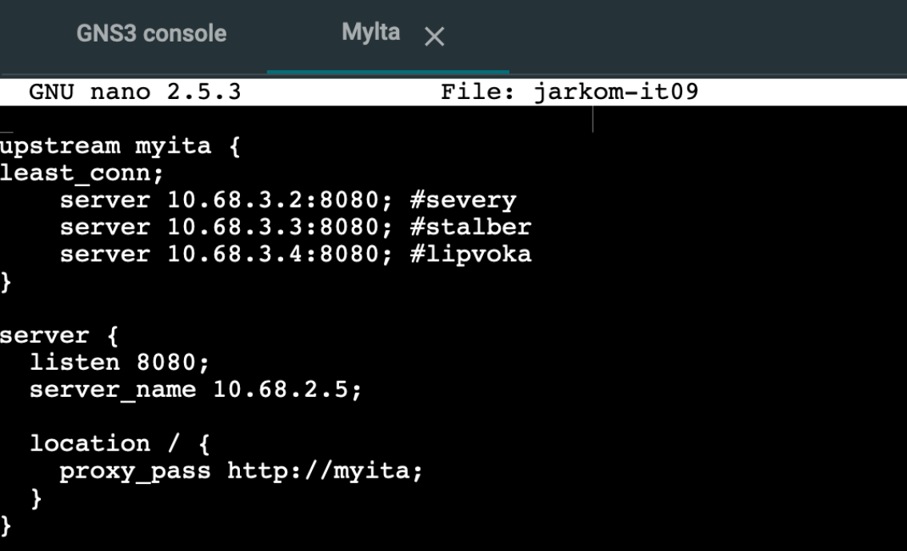

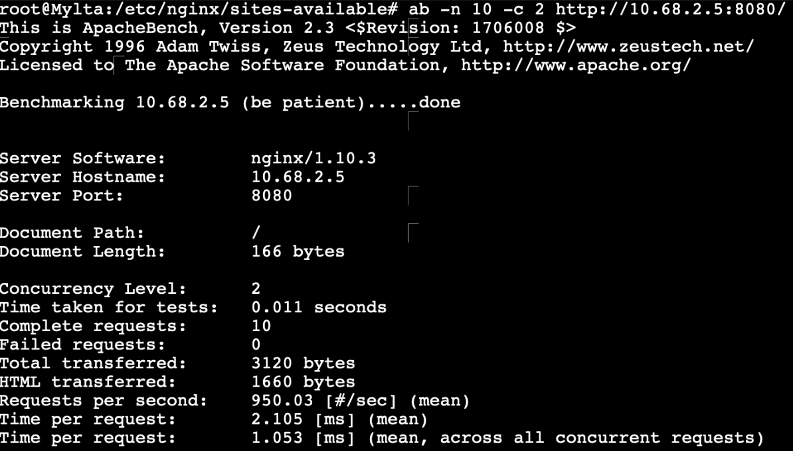

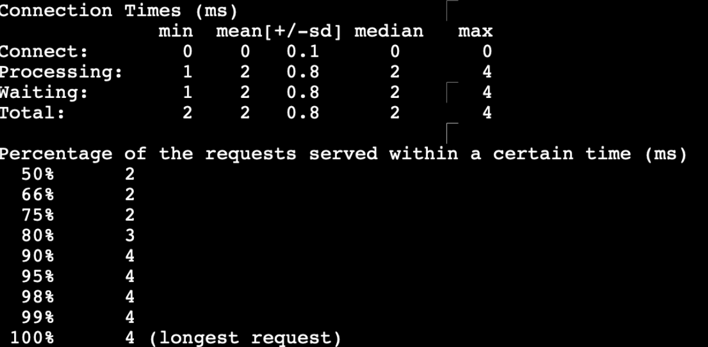

Kesimpulan : Least Connections memiliki kinerja yang lebih baik dalam menangani beban lalu lintas dibandingkan dengan Round Robin. Least Connections mampu menangani lebih banyak permintaan dalam waktu yang sama, memberikan respons yang lebih cepat, dan memiliki kecepatan transfer yang lebih tinggi, dan  lebih baik dalam menangani beban lalu lintas dengan waktu proses yang lebih rendah

Selebihnya di : https://docs.google.com/document/d/1RNiwSTX7fa-01DJ5N1eOw96GoBZOdjdA2orrkkywhkk/edit
