# Jarkom-Modul-2-IT09-2024

| Nama | NRP |
|---------|---------|
| Gavriel Pramuda Kurniaadi | 5027221031  |
| Stephanie Hebrina Mabunbun Simatupang | 5027221069  | 

## No 1
> Untuk membantu pertempuran di Erangel, kamu ditugaskan untuk membuat jaringan komputer yang akan digunakan sebagai alat komunikasi. Sesuaikan rancangan Topologi dengan rancangan dan pembagian yang berada di link yang telah disediakan, dengan ketentuan nodenya sebagai berikut :

>a. DNS Master akan diberi nama Pochinki, sesuai dengan kota tempat dibuatnya server tersebut

>b. Karena ada kemungkinan musuh akan mencoba menyerang Server Utama, maka buatlah DNS Slave Georgopol yang mengarah ke Pochinki

>c. Markas pusat juga meminta dibuatkan tiga Web Server yaitu Severny, Stalber, dan Lipovka. Sedangkan Mylta akan bertindak sebagai Load Balancer untuk server-server tersebut

### Topologi 
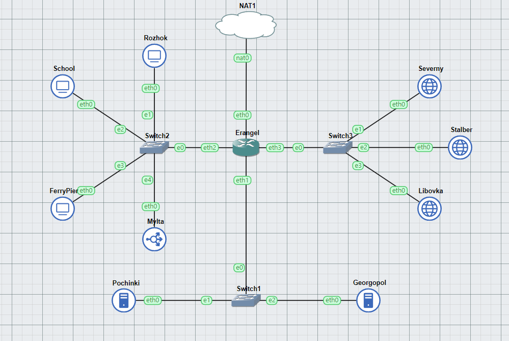

### IP Address :
- Pochinki (10.68.1.2) (DNS Master)
- Georgopol (10.68.1.3) (DNS Slave)
- Rozhok (10.68.2.2) (Client)
- School (10.68.2.3) (Client)
- FerryPier (10.68.2.4) (Client)
- Mylta (10.68.2.5) (Load Balancer)
- Severny (10.68.3.2) (Webserver)
- Stalber (10.68.3.3) (Webserver)
- Lipovka (10.68.3.4) (Webserver)

## No 2
> Karena para pasukan membutuhkan koordinasi untuk mengambil airdrop, maka buatlah sebuah domain yang mengarah ke Stalber dengan alamat airdrop.xxxx.com dengan alias www.airdrop.xxxx.com dimana xxxx merupakan kode kelompok. Contoh : airdrop.it01.com

### Pengerjaan
Membuat script.sh pada node pochinki dengan kode sebagai berikut:
```
echo 'nameserver 192.168.122.1' > /etc/resolv.conf

apt-get update
apt-get install bind9 -y

echo 'zone "airdrop.it09.com" {
        type master;
        file "/etc/bind/jarkom/airdrop.it09.com";
};' > /etc/bind/named.conf.local

mkdir /etc/bind/jarkom

cp /etc/bind/db.local /etc/bind/jarkom/airdrop.it09.com

echo '
;
; BIND data file for local loopback interface
;
$TTL    604800
@       IN      SOA     airdrop.it09.com. root.airdrop.it09.com. (
                        2      ; Serial
                         604800         ; Refresh
                          86400         ; Retry
                        2419200         ; Expire
                         604800 )       ; Negative Cache TTL
;
@       IN      NS      airdrop.it09.com.
@       IN      A        10.68.3.3
www     IN      CNAME   airdrop.it09.com.' > /etc/bind/jarkom/airdrop.it09.com

service bind9 restart
```
### Output
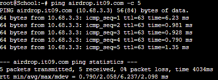

## Soal 3
>Para pasukan juga perlu mengetahui mana titik yang sedang di bombardir artileri, sehingga dibutuhkan domain lain yaitu redzone.xxxx.com dengan alias www.redzone.xxxx.com yang mengarah ke Severny

### Pengerjaan
Menambahkan kode script.sh pada node Pochinki
```echo 'zone "redzone.it09.com" {
        type master;
        file "/etc/bind/jarkom/redzone.it09.com";
};' > /etc/bind/named.conf.local

cp /etc/bind/db.local /etc/bind/jarkom/redzone.it09.com

echo ' 
;
; BIND data file for local loopback interface
;
$TTL    604800
@       IN      SOA     redzone.it09.com. root.redzone.it09.com. (
                        2      ; Serial
                         604800         ; Refresh
                          86400         ; Retry
                        2419200         ; Expire
                         604800 )       ; Negative Cache TTL
;
@       IN      NS      redzone.it09.com.
@       IN      A       10.68.3.2
www     IN      CNAME   redzone.it09.com.' > /etc/bind/jarkom/redzone.it09.com

service bind9 restart
```
### Output
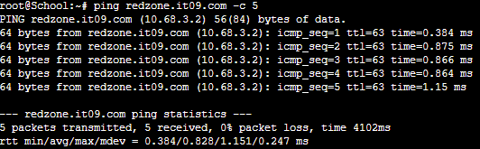

## Soal 4
> Markas pusat meminta dibuatnya domain khusus untuk menaruh informasi persenjataan dan suplai yang tersebar. Informasi persenjataan dan suplai tersebut mengarah ke Mylta dan domain yang ingin digunakan adalah loot.xxxx.com dengan alias www.loot.xxxx.com

### Pengerjaan
Menambahkan kode script.sh pada node Pochinki
```echo 'zone "loot.it09.com" {
        type master;
        file "/etc/bind/jarkom/loot.it09.com";
};' >> /etc/bind/named.conf.local

cp /etc/bind/db.local /etc/bind/jarkom/loot.it09.com

echo ' 
;
; BIND data file for local loopback interface
;
$TTL    604800
@       IN      SOA     loot.it09.com. root.loot.it09.com. (
                        2      ; Serial
                         604800         ; Refresh
                          86400         ; Retry
                        2419200         ; Expire
                         604800 )       ; Negative Cache TTL
;
@       IN      NS      loot.it09.com.
@       IN      A       10.68.2.5
www     IN      CNAME   loot.it09.com.' > /etc/bind/jarkom/loot.it09.com

service bind9 restart
```
### Output
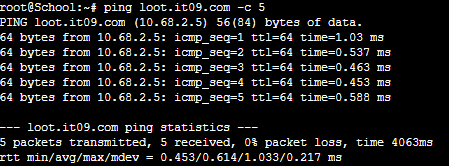

## Soal 5
> Pastikan domain-domain tersebut dapat diakses oleh seluruh komputer (client) yang berada di Erangel

### Pengerjaan
Menambahkan IP 192.168.122.1 ke /etc/resolv.conf masing-masing client.

### Output
- Rozhok <br>
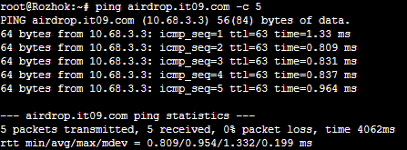
- School <br>

- Ferrypier <br>
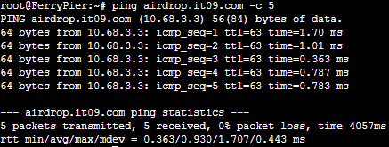

## Soal 6
> Beberapa daerah memiliki keterbatasan yang menyebabkan hanya dapat mengakses domain secara langsung melalui alamat IP domain tersebut. Karena daerah tersebut tidak diketahui secara spesifik, pastikan semua komputer (client) dapat mengakses domain redzone.xxxx.com melalui alamat IP Severny (Notes : menggunakan pointer record)

### Pengerjaan
```echo ' zone "2.3.68.10.in-addr.arpa" {
        type master;
        file "/etc/bind/jarkom/2.3.68.10.in-addr.arpa";
};' >> /etc/bind/named.conf.local

cp /etc/bind/db.local /etc/bind/jarkom/2.3.68.10.in-addr.arpa

echo '
;
; BIND data file for local loopback interface
;
$TTL    604800
@       IN      SOA     redzone.it09.com. root.redzone.it09.com. (
                        2      ; Serial
                         604800         ; Refresh
                          86400         ; Retry
                        2419200         ; Expire
                         604800 )       ; Negative Cache TTL
;
2.3.68.10.in-addr.arpa. IN      NS      redzone.it09.com.
1                     IN      PTR     redzone.it09.com.' > /etc/bind/jarkom/2.3.68.10.in-addr.arpa

service bind9 restart
```
### Output
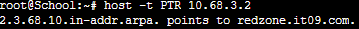

## Soal 7
> Akhir-akhir ini seringkali terjadi serangan siber ke DNS Server Utama, sebagai tindakan antisipasi kamu diperintahkan untuk membuat DNS Slave di Georgopol untuk semua domain yang sudah dibuat sebelumnya

### Pengerjaan
1. Menambahkan allow-transfer dan also-notify pada masing-masing zone di program script.sh pada node Pochinki
```echo 'zone "airdrop.it09.com" {
        type master;
        file "/etc/bind/jarkom/airdrop.it09.com";
        allow-transfer { 10.68.1.3; }; // IP Georgopol
        also-notify { 10.68.1.3; }; // IP Georgopol
};' > /etc/bind/named.conf.local


echo 'zone "redzone.it09.com" {
        type master;
        file "/etc/bind/jarkom/redzone.it09.com";
        also-notify { 10.68.1.3; }; // IP Georgopol
        allow-transfer { 10.68.1.3; }; // IP Georgopol
   
};' >> /etc/bind/named.conf.local

echo 'zone "loot.it09.com" {
        type master;
        file "/etc/bind/jarkom/loot.it09.com";
        also-notify { 10.68.1.3; }; // IP Georgopol
        allow-transfer { 10.68.1.3; }; // IP Georgopol
   
};' >>/etc/bind/named.conf.local

service bind9 restart
```

2. Buat script.sh pada node Georgopol dengan kode di bawah ini
```
echo 'zone "airdrop.it09.com" {
    type slave;
    masters { 10.68.1.2; }; // IP Pochinki
    file "/var/lib/bind/airdrop.it09.com";
};

zone "redzone.it09.com" {
    type slave;
    masters { 10.68.1.2; }; // IP Pochinki
    file "/var/lib/bind/redzone.it09.com";
};

zone "loot.it09.com" {
    type slave;
    masters { 10.68.1.2; }; // IP Pochinki
    file "/var/lib/bind/loot.it09.com";
};'  > /etc/bind/named.conf.local
```


Untuk mengetesnya, bind9 pada pochinki perlu diberhentikan dengan ```service bind9 stop```

### Output
- Start Georgopol <br>
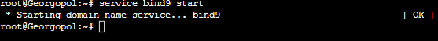
- Stop Pochinki <br>
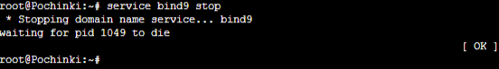
- Test di Client <br>
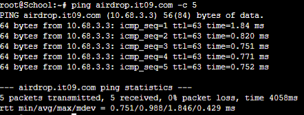

## Soal 8
> Kamu juga diperintahkan untuk membuat subdomain khusus melacak airdrop berisi peralatan medis dengan subdomain medkit.airdrop.xxxx.com yang mengarah ke Lipovka

### Pengerjaan
Menambahkan program ke script.sh pada node Pochinki
```
echo '
;
; BIND data file for local loopback interface
;
$TTL    604800
@       IN      SOA     airdrop.it09.com. root.airdrop.it09.com. (
                        2      ; Serial
                         604800         ; Refresh
                          86400         ; Retry
                        2419200         ; Expire
                         604800 )       ; Negative Cache TTL
;
@       IN      NS      airdrop.it09.com.
@       IN      A        10.68.3.3   ; 
www     IN      CNAME   airdrop.it09.com.
medkit  IN      A       10.68.3.4     ;' > /etc/bind/jarkom/airdrop.it09.com

service bind9 restart
```

### Output
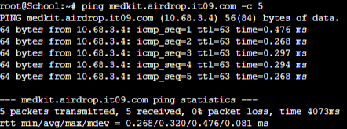

## Soal 9
> Terkadang red zone yang pada umumnya di bombardir artileri akan dijatuhi bom oleh pesawat tempur. Untuk melindungi warga, kita diperlukan untuk membuat sistem peringatan air raid dan memasukkannya ke subdomain siren.redzone.xxxx.com dalam folder siren dan pastikan dapat diakses secara mudah dengan menambahkan alias www.siren.redzone.xxxx.com dan mendelegasikan subdomain tersebut ke Georgopol dengan alamat IP menuju radar di Severny

### Pengerjaan
1. Menambahkan program ke script.sh pada node Pochinki
```
echo ';
; BIND data file for local loopback interface
;
$TTL    604800
@       IN      SOA     redzone.it09.com. root.redzone.it09.com. (
                        2               ; Serial
                         604800         ; Refresh
                          86400         ; Retry
                        2419200         ; Expire
                         604800 )       ; Negative Cache TTL
;
@       IN      NS      redzone.it09.com.
@       IN      A       10.68.3.2
www     IN      CNAME   redzone.it09.com.
ns1     IN      A       10.68.1.3     ; IP Georgopol
siren   IN      NS      ns1' > /etc/bind/jarkom/redzone.it09.com


echo "options {
    directory \"/var/cache/bind\";

    // If there is a firewall between you and nameservers you want
    // to talk to, you may need to fix the firewall to allow multiple
    // ports to talk.  See http://www.kb.cert.org/vuls/id/800113

    // If your ISP provided one or more IP addresses for stable
    // nameservers, you probably want to use them as forwarders.
    // Uncomment the following block, and insert the addresses replacing
    // the all-0's placeholder.  
    // };

    //========================================================================
    // If BIND logs error messages about the root key being expired,
    // you will need to update your keys.  See https://www.isc.org/bind-keys
    //========================================================================
    //dnssec-validation auto;

    allow-query { any; };
    auth-nxdomain no;
    listen-on-v6 { any; };
};" > /etc/bind/named.conf.options

service bind9 restart
```
2. Menambahkan program ke script.sh pada node Georgopol
```
echo "
options {
        directory \"/var/cache/bind\";
        allow-query{any;};
        auth-nxdomain no;
        listen-on-v6 { any; };
};
" > /etc/bind/named.conf.options

echo '

zone "siren.redzone.it09.com"{
        type master;
        file "/etc/bind/siren/siren.redzone.it09.com";
};
'>> /etc/bind/named.conf.local

mkdir /etc/bind/siren

echo "
\$TTL    604800
@       IN      SOA     siren.redzone.it09.com. root.siren.redzone.it09.com. (
                        2      ; Serial
                        604800         ; Refresh
                        86400         ; Retry
                        2419200         ; Expire
                        604800 )       ; Negative Cache TTL
;
@               IN      NS      siren.redzone.it09.com.
@               IN      A       10.68.3.2       ;IP Severny
www             IN      CNAME   siren.redzone.it09.com.
" > /etc/bind/siren/siren.redzone.it09.com
service bind9 restart
```

### Output
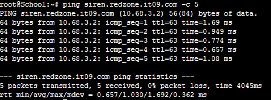

## Soal 10
> Markas juga meminta catatan kapan saja pesawat tempur tersebut menjatuhkan bom, maka buatlah subdomain baru di subdomain siren yaitu log.siren.redzone.xxxx.com serta aliasnya www.log.siren.redzone.xxxx.com yang juga mengarah ke Severny

### Pengerjaan
1. Menambahkan program ke script.sh pada node Georgopol
```
echo "
\$TTL    604800
@       IN      SOA     siren.redzone.it09.com. root.siren.redzone.it09.com. (
                        2      ; Serial
                        604800         ; Refresh
                        86400         ; Retry
                        2419200         ; Expire
                        604800 )       ; Negative Cache TTL
;
@               IN      NS      siren.redzone.it09.com.
@               IN      A       10.68.3.2       
www             IN      CNAME   siren.redzone.it09.com.
log             IN      A       10.68.3.2       
www.log         IN      CNAME   log.siren.redzone.it09.com." > /etc/bind/siren/siren.redzone.it09.com
service bind9 restart
```
### Output
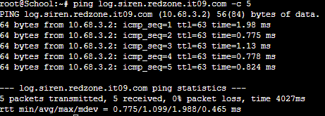

## Soal 11
>Setelah pertempuran mereda, warga Erangel dapat kembali mengakses jaringan luar, tetapi hanya warga Pochinki saja yang dapat mengakses jaringan luar secara langsung. Buatlah konfigurasi agar warga Erangel yang berada diluar Pochinki dapat mengakses jaringan luar melalui DNS Server Pochinki

### Pengerjaan
1. Menambahkan program ke script.sh pada node Pochinki
```

echo '
options {
        directory "/var/cache/bind";
        forwarders {
                192.168.122.1;
        };
        allow-query { any; };
        auth-nxdomain no; #conform to RFC1035
        listen-on-v6 { any; };
};' > /etc/bind/named.conf.options


```

2. Mengganti IP pada nameserver dengan IP Pochinki

```
echo '
nameserver 10.68.1.2
' > /etc/resolv.conf
```

### Output
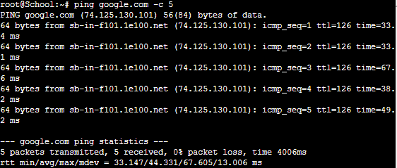

# no 12
> Karena pusat ingin sebuah website yang ingin digunakan untuk memantau kondisi markas lainnya maka deploy lah webiste ini (cek resource yg lb) pada severny menggunakan apache

Install :
```
apt-get update
apt-get install lynx
apt-get install apache2
apt-get install php
apt-get install libapache2-mod-php7.0`

wget --no-check-certificate 'https://drive.google.com/uc?export=download&id=1xn03kTB27K872cokqwEIlk8Zb121HnfB' -O /var/www/jarkom-it09/lb.zip

unzip /var/www/jarkom-it09/lb.zip -d /var/www/jarkom-it09/

mv /var/www/jarkom-it09/worker/index.php /var/www/html/
```

ke dir apache2/sites-available kemudian edit file .conf nya :

```
cd /etc/apache2/sites-available
cp 000-default.conf jarkom-it09.conf
nano jarkom-it09.conf
```

di file jarkom-it09.conf edit bagian :
``` 
<VirtualHost *:8080> 
#ubah portnya menjadi 8080
ServerAdmin webmaster@localhost
DocumentRoot /var/www/jarkom-it09
```

Tambahkan port 8080 juga di file ports.conf :
```
cd /etc/apache2
nano ports.conf
```

Tambahan di File ports :
```
Listen 80
Listen 8080 #tambah ini
```

Jalanin command :
```
a2ensite jarkom-it09.conf
service apache2 restart
```

run di :
```
lynx http://10.68.3.2:8080
```

Outputnya :


# no 13 
> Tapi pusat merasa tidak puas dengan performanya karena traffic yag tinggi maka pusat meminta kita memasang load balancer pada web nya, dengan Severny, Stalber, Lipovka sebagai worker dan Mylta sebagai Load Balancer menggunakan apache sebagai web server nya dan load balancernya

Instal :
```
apt-get update
apt-get install apache2
a2enmod proxy
a2enmod proxy_http
a2enmod proxy_balancer
a2enmod lbmethod_byrequests
service apache2 restart
```

```
cd /etc/apache2/sites-available/
```

define addres ketiga workersnya :
```
#address
serverny="10.68.3.2"
stalber="10.68.3.3"
lipovka="10.68.3.4"
```

Isi config file :
```
echo "<VirtualHost *:8080>
    ServerAdmin webmaster@localhost
    DocumentRoot /var/www/web-8080
    ServerName 10.68.2.5

    ProxyRequests Off
    <Proxy balancer://mycluster>
        BalancerMember http://${serverny}:8080
        BalancerMember http://${stalber}:8080
        BalancerMember http://${lipovka}:8080
        ProxySet lbmethod=byrequests
    </Proxy>

    ProxyPass / balancer://mycluster/
    ProxyPassReverse / balancer://mycluster/
</VirtualHost>" > default-8080.conf
```

```
cd ..
echo 'Listen 8080' >> ports.conf
```

Run apache2 nya :
```
a2ensite default-8080.conf
service apache2 restart
```

Output : 
> worker


> load balancer


[13](output/demo-13.mov)

# no 14
> Mereka juga belum merasa puas jadi pusat meminta agar web servernya dan load balancer nya diubah menjadi nginx

Install :
```
apt-get update
apt-get install dnsutils -y
apt-get install lynx -y
apt-get install nginx -y
apt-get install apache2 -y
apt-get install libapache2-mod-php7.0
apt-get install wget -y
apt-get install unzip -y
apt-get install php -y
apt-get install php-fpm -y
```

> Load balancer (mylta)
Atur port di :
```
cd /etc/apache2
nano ports.conf
```

Buat menjadi :
```
Listen 8080
```

Nginxnya distart :
```
service nginx start
```

Pindah direktori dan tambahkan file :
```
cd /etc/nginx/sites-available/
nano jarkom-it09
```

Isi nano jarkom-it09 :
```
upstream myita {
    server 10.68.3.2:8080; #stabler
    server 10.68.3.2:8080; #serverny
    server 10.68.3.2:8080; #lipvoka
}

server {
  listen 8080;
  server_name 10.68.2.5;

  location / {
    proxy_pass http://myita;
  }
}
```

Run jarkom-it09 :
```
ln -s /etc/nginx/sites-available/jarkom-it09 /etc/nginx/sites-enabled
rm /etc/nginx/sites-enabled/default
service nginx restart
```

> Worker (severny, stalber, libovka) :

Pindah direktori dan edit port:
```
cd /etc/apache2
nano ports.conf
```

Tambah :
```
Listen 8080
```

Run :
```
service nginx start
```

Check isi file /var/www/jarkom-it09 :
```
cd /var/www/jarkom-it09
```

Disini isi file nano index.php harusnya sama dengan nomor 12 karena sudah didownload tadi dari wget.

>Isi index.php :
```
<?php
$hostname = gethostname();
$date = date('Y-m-d H:i:s');
$php_version = phpversion();
$username = get_current_user();


echo "Hello World!<br>";
echo "Saya adalah: $username<br>";
echo "Saat ini berada di: $hostname<br>";
echo "Versi PHP yang saya gunakan: $php_version<br>";
echo "Tanggal saat ini: $date<br>";
?>
```

Pindah direkotri : 
```
cd /etc/nginx/sites-available/
nano jarkom-it09
```

Jarkom-it09 : 
```
server {

    listen 8080;

    root /var/www/jarkom-it09;

    index index.php index.html index.htm;
    server_name _;

    location / {
        try_files \$uri \$uri/ /index.php?\$query_string;
    }

    # pass PHP scripts to FastCGI server
    location ~ \.php$ {
        include snippets/fastcgi-php.conf;
        fastcgi_pass unix:/var/run/php/php7.0-fpm.sock;
    }

    location ~ /\.ht {
     deny all;
    }

    error_log /var/log/nginx/jarkom-it09_error.log;
    access_log /var/log/nginx/jarkom-it09_access.log;
}
```

```
ln -s /etc/nginx/sites-available/jarkom-it09 /etc/nginx/sites-enabled
rm /etc/nginx/sites-enabled/default
```

Run nginx dengan restart :

```
service nginx restart
```

Also run phpnya juga : 
```
service php7.0-fpm start
```

Ini untuk check apakah sudah berhasil dirun atau tidak phpnyaaa :
```
service php7.0-fpm status
```

Ouptut : 
> lnyx 10.68.3.2:8080 : stabler


> lynx 10.68.3.2:8080 : serverny


> lynx 10.68.3.2:8080 : lipvoka


> lynx 10.68.25:8080 : mylta


# no 15
Markas pusat meminta laporan hasil benchmark dengan menggunakan apache benchmark dari load balancer dengan 2 web server yang berbeda tersebut dan meminta secara detail dengan ketentuan:
Nama Algoritma Load Balancer
Report hasil testing apache benchmark 
Grafik request per second untuk masing masing algoritma. 
Analisis

Berdasarkan soal diatas kita harus intall :
``` 
apt-get install apache2-utils
```
Command tersebut digunakan untuk menguji kinerja server web Apache atau server web lainnya

Melakukan pengujian (benchmarking) untuk menguji algoritma load balancing :

```
ab -n 10 -c 2 http://10.68.2.5:8080/ 

```

Command diatas untuk mengirim 10 request, 1 waktunya 2 request

> Round-robin :


Kesimpulannya adalah bahwa server mampu menangani beban dengan baik. Tidak ada permintaan yang gagal, tingkat throughput tinggi, waktu respons yang cepat, dan kecepatan transfer yang tinggi semuanya menunjukkan bahwa server mampu menangani beban dengan efisien dan efektif.

> least-conn :

Menambahkan least-conn di line 2


Kesimpulan : Least Connections memiliki kinerja yang lebih baik dalam menangani beban lalu lintas dibandingkan dengan Round Robin. Least Connections mampu menangani lebih banyak permintaan dalam waktu yang sama, memberikan respons yang lebih cepat, dan memiliki kecepatan transfer yang lebih tinggi, dan  lebih baik dalam menangani beban lalu lintas dengan waktu proses yang lebih rendah

Selebihnya di : https://docs.google.com/document/d/1RNiwSTX7fa-01DJ5N1eOw96GoBZOdjdA2orrkkywhkk/edit

# no 16 
Karena dirasa kurang aman karena masih memakai IP markas ingin akses ke mylta memakai mylta.xxx.com dengan alias www.mylta.xxx.com (sesuai web server terbaik hasil analisis kalian)

Ke root Pochinki, tambahkan:
```
echo 'zone "mylta.it09.com" {
    type master;
    file "/etc/bind/jarkom/mylta.it09.com";
};' >> /etc/bind/named.conf.local

echo ';
; BIND data file for local loopback interface
;
$TTL    604800
@       IN      SOA     mylta.it09.com. root.mylta.it09.com. (
                                2         ; Serial
                                604800    ; Refresh
                                86400     ; Retry
                                2419200   ; Expire
                                604800 )  ; Negative Cache TTL
;
@       IN      NS      mylta.it09.com.
@       IN      A       10.68.2.5       ; IP Mylta
www     IN      CNAME   mylta.it09.com.' > /etc/bind/jarkom/mylta.it09.com

service bind9 restart
```

# no 17
Agar aman, buatlah konfigurasi agar mylta.xxx.com hanya dapat diakses melalui port 14000 dan 14400. 

```
echo 'upstream myita {
    server 10.68.3.2; #stabler
    server 10.68.3.2; #serverny
    server 10.68.3.2; #lipvoka
}

server {
listen 14000;
listen 14400;
server_name 10.68.2.5; 

location / {
proxy_pass http://myita;
}
}
' > /etc/nginx/sites-enabled/default

service nginx restart
```

Output : ada di video 

# no 18
Apa bila ada yang mencoba mengakses IP mylta akan secara otomatis dialihkan ke www.mylta.xxx.com

```
echo '
server {
    listen 10.68.2.5:14000; 
    listen 10.68.2.5:14400; 
    server_name 10.68.2.5;

    return 301 $scheme://www.mylta.it09.com$request_uri; # Redirect to www.mylta.it09.com
}
' > /etc/nginx/sites-available/redirect_ip

ln -s /etc/nginx/sites-available/redirect_ip /etc/nginx/sites-enabled/redirect_ip

nginx -t

service nginx restart
```
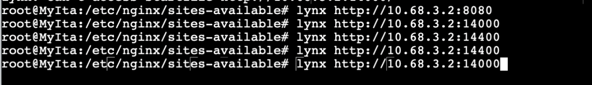


# no 19
Karena probset sudah kehabisan ide masuk ke salah satu worker buatkan akses direktori listing yang mengarah ke resource worker2
```
cp -r dr-listing/worker2 /var/www/jarkom/
```

```
echo -e "server {
        listen 14000;

        root /var/www/jarkom;
        index index.php index.html index.htm index.nginx-debian.html;
        server_name _;

        location / {
                try_files $uri $uri/ /index.php?$query_string;
        }

        location /worker2 {
                autoindex on;
                autoindex_exact_size off;
        }

        location ~ \.php$ {
                include snippets/fastcgi-php.conf;
                fastcgi_pass unix:/var/run/php/php7.0-fpm.sock;
        }

        location ~ /\.ht {
                deny all;
        }
}" > /etc/nginx/sites-available/jarkom

service nginx restart
```

# no 20
Worker tersebut harus dapat di akses dengan tamat.xxx.com dengan alias www.tamat.xxx.com

Masuk ke root pochinki, kemudian tambah :
```
zone "tamat.it09.com" {
        type master;
        file "/etc/bind/tamat/tamat.it09.com";
};
' > /etc/bind/named.conf.local
mkdir /etc/bind/tamat

cp /etc/bind/db.local /etc/bind/tamat/tamat.it09.com

echo '
;
; BIND data file for local loopback interface
;
$TTL    604800
@       IN      SOA     tamat.it09.com. tamat.mylta.it09.com. (
                              2         ; Serial
                         604800         ; Refresh
                          86400         ; Retry
                        2419200         ; Expire
                         604800 )       ; Negative Cache TTL
;
@       IN      NS      tamat.it9.com.
@       IN      A       10.68.2.5  # IP
@       IN      AAAA    ::1
www     IN      CNAME   tamat.it09.com.
' > /etc/bind/tamat/tamat.it09.com

service bind9 restart
```

Demo : <video controls src="output/0508.mp4" title="huaa"></video>